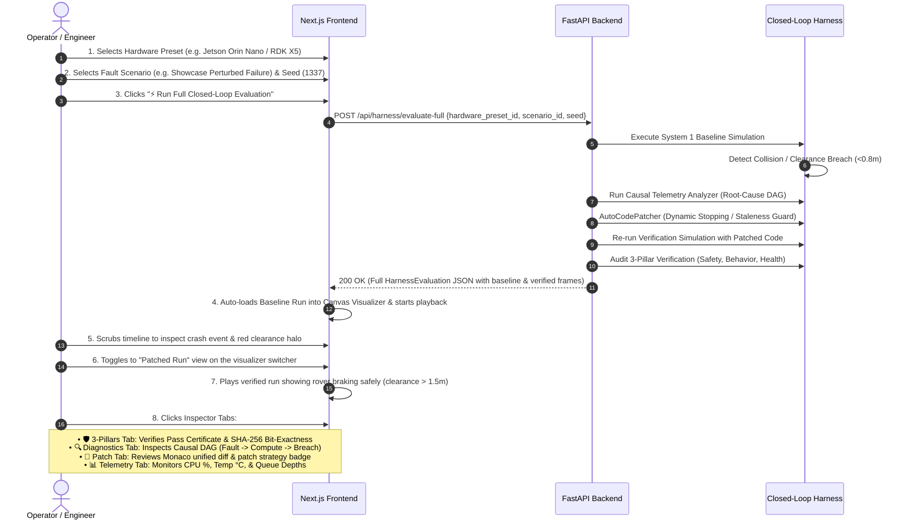
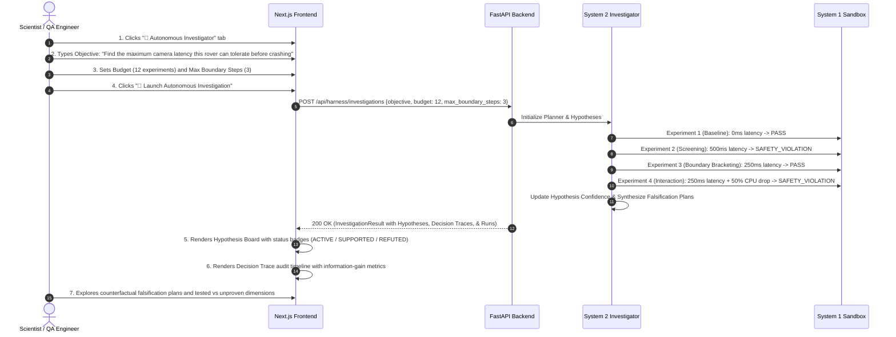

# Harness-Agent: Frontend User Journeys, Design System & Layout Specification

## 1. Executive Summary & Product Architecture

**Harness-Agent** is a deterministic, hardware-semantic Software-in-the-Loop (SIL) testbed and autonomous agent reliability harness. It enables engineers and AI researchers to stress-test robotics algorithms against realistic edge hardware perturbations (compute degradation, transport latency, sensor jitter, thermal throttling, actuator lag), automatically diagnose failure root causes, synthesize AST-safe code repairs, and prove invariant safety.

The frontend is built with **Next.js (App Router), TypeScript, and Tailwind CSS**, featuring a 60Hz 2D HTML5 Canvas simulation visualizer, real-time hardware telemetry HUDs, causal dependency DAG graphs, code diff viewers, and an autonomous hypothesis exploration workspace.

```
+----------------------------------------------------------------------------------------------------+
|                                    HARNESS-AGENT FRONTEND UI                                       |
|                                                                                                    |
|  +----------------------------------------------------------------------------------------------+  |
|  | [TF] TrueForge Harness-Agent     [⚡ Evaluation Workbench]   [🔬 Autonomous Investigator]    |  |
|  | API: CONNECTED (localhost:8000)                                                  v0.2.0      |  |
|  +----------------------------------------------------------------------------------------------+  |
|                                                                                                    |
|  +---------------------------+ +-------------------------------+ +-------------------------------+ |
|  |  LEFT RAIL (3 cols)       | |  CENTER STAGE (5 cols)        | |  RIGHT INSPECTOR (4 cols)     | |
|  |  • Edge Board Presets     | |  • Run View Switcher          | |  • 🛡️ 3-Pillar Safety Gate    | |
|  |  • Fault Scenario Picker  | |  • 50m×50m 2D Canvas Engine   | |  • 🔍 Causal Root Cause DAG   | |
|  |  • Seed & Time Controls   | |  • Scrubber & Playback Loop   | |  • 📝 Patch Diff & Rationale  | |
|  |  • [Run Full Evaluation]  | |  • Vehicle Dynamics HUD       | |  • 📊 Edge Hardware Telemetry | |
|  +---------------------------+ +-------------------------------+ +-------------------------------+ |
+----------------------------------------------------------------------------------------------------+
```

---

## 2. Core User Journeys

The frontend accommodates two primary user personas and operational workflows:

---

### Journey A: The Closed-Loop Evaluation (The Main Demo Flow)
> **Goal:** Run an autonomous end-to-end resilience test that injects compound hardware faults, causes a baseline safety failure, diagnoses the root cause, synthesizes a hardened controller patch, and deterministically verifies the fix.



#### Detailed Journey Step-by-Step Breakdown:
1. **Initial Selection & Parameter Configuration:**
   - User navigates to `Evaluation Workbench` tab.
   - User picks target edge compute hardware (e.g., *NVIDIA Jetson Orin Nano* or *D-Robotics RDK X5*). The UI dynamically renders board specs (ARM cores, TDP watts, thermal limits, NPU TOPS).
   - User selects the scenario `showcase_perturbed_failure`. The UI displays the active fault schedule (+310ms camera latency, 0.7s LiDAR blackout, 60% brake fading).
   - User inputs Seed `1337` and Max Sim Time `12.0s`.

2. **Triggering the Evaluation:**
   - User clicks **"⚡ Run Full Closed-Loop Evaluation"**.
   - The button shows an animated loading spinner (*"Running Closed Loop (System 2)..."*).
   - API issues `POST /api/harness/evaluate-full`.

3. **Baseline Failure Review:**
   - Upon completion, the canvas immediately populates with the 1,500–3,000 frames from `baseline_run`.
   - Visualizer auto-plays: the rover moves towards the goal, encounters the crossing obstacle while experiencing camera staleness and delayed braking, breaching the safety perimeter (<0.8m).
   - A pulsing red **"⚠️ CRITICAL VIOLATION: MIN_CLEARANCE_BREACH"** banner displays on top of the canvas with exact timestamp and minimum distance ($0.42\text{ m}$).

4. **Switching to Verified Run:**
   - The user clicks the **"Patched (0 Violations)"** button on the dual-trace switcher bar.
   - The canvas smoothly transitions frames to the hardened verification run.
   - The user watches the rover execute early dynamic stopping and reach the goal safely with zero violations.

5. **Deep Diagnostic & Patch Inspection:**
   - **3-Pillars Verification Tab**: Shows all green badges for Pillar 1 (Safety Invariant), Pillar 2 (Behavioral Completion), and Pillar 3 (Runtime Health), along with the improvement summary and bit-exact deterministic hash.
   - **Causal Diagnostics Tab**: Renders the Root Cause statement and the 3-stage causal chain (`Hardware Transport Perturbation` $\to$ `Sensor Queue Bottleneck` $\to$ `Actuation Delay & Invariant Breach`).
   - **Patch Diff Tab**: Renders the unified diff with syntax-highlighted Python modifications and strategy tags (`Dynamic Stopping`, `Staleness Guard`).

---

### Journey B: The Autonomous Investigator (The AI Science Explorer)
> **Goal:** Formulate a high-level scientific inquiry regarding vehicle failure boundaries, let System 2 plan and execute bounded System 1 experiments, and observe real-time hypothesis falsification and decision traces.



#### Detailed Journey Step-by-Step Breakdown:
1. **Objective Definition:**
   - User switches to the `Autonomous Investigator` tab.
   - User selects an inquiry template or enters a custom prompt:
     `"Investigate vehicle safety boundary under camera latency and compute degradation"`.
   - Configures exploration parameters: Experiment Budget = `12`, Boundary Refinements = `3`, Seed = `1337`.

2. **System 2 Bounded Search Execution:**
   - User clicks **"🚀 Launch Autonomous Investigation"**.
   - The backend runs the 4-stage exploration policy:
     - **Stage 1 (Baseline)**: Tests nominal configuration (0ms latency) $\to$ `PASS`.
     - **Stage 2 (Screening)**: Tests upper boundary (500ms latency) $\to$ `SAFETY_VIOLATION`.
     - **Stage 3 (Boundary)**: Binary bisects (250ms latency) $\to$ `PASS` (narrows boundary to 250ms–500ms).
     - **Stage 4 (Interaction)**: Tests multi-fault interaction (250ms latency + 50% CPU throttling) $\to$ `SAFETY_VIOLATION`.

3. **Hypothesis Board Analysis:**
   - Displays dynamic cards with confidence meters:
     - *Hypothesis 1 (SUPPORTED - 88% confidence)*: *"Camera latency $> 350\text{ ms}$ triggers unrecoverable braking lag."*
     - *Hypothesis 2 (REFUTED - 12% confidence)*: *"CPU throttling alone causes trajectory deviation."*
     - *Hypothesis 3 (ACTIVE - 65% confidence)*: *"Compound latency and thermal throttling accelerate deadline misses non-linearly."*
   - Each card displays supporting/contradicting experiment badges and falsification counter-tests.

4. **Decision Trace Audit Trail:**
   - Chronological step-by-step log displaying:
     - Experiment Phase (`BASELINE`, `SCREEN`, `BOUNDARY`, `INTERACTION`).
     - Information Gain estimate ($\Delta I$).
     - Outcome classification (`PASS`, `SAFETY_VIOLATION`, `RUN_FAILURE`, `CONTROLLER_UNHEALTHY`).
     - Rationale and next planned action.

---

### Journey C: Live WebSocket Streaming & Interactive Stepping
> **Goal:** Watch live real-time simulation physics and sensor frame ingestion over WebSocket, with on-the-fly fault monitoring.

1. User selects a scenario and clicks **"🔴 Live Stream (WebSocket)"**.
2. Frontend opens connection to `ws://localhost:8000/ws/live/{scenario_id}`.
3. Backend steps simulation at 30–50 FPS, streaming `WSFrameMessage` payloads.
4. Canvas renders smooth live animation; Hardware and Vehicle HUDs tick in real-time.
5. User can stop stream at any time or trigger instant replay determinism verification.

---

## 3. UI Layout & Screen Wireframes

### Wireframe 1: Evaluation Workbench (Flow A)

```
+------------------------------------------------------------------------------------------------------------------+
| HEADER: [TF] TrueForge Harness-Agent | [⚡ Evaluation Workbench]* [🔬 Autonomous Investigator] | API: CONNECTED  |
+------------------------------------------------------------------------------------------------------------------+
| LEFT RAIL (3 cols)            | CENTER COLUMN (5 cols)                       | RIGHT INSPECTOR (4 cols)          |
|-------------------------------|----------------------------------------------|-----------------------------------|
| TARGET HARDWARE PRESET        | [PLAYBACK: (•) Baseline (1 Viol) [•] Patched (0 Viol)] | [🛡️ 3-Pillars] [🔍 Diag] [📝 Diff] [📊 HUD] |
| [ Dropdown: Jetson Orin Nano] |----------------------------------------------|-----------------------------------|
| Arch: ARM Cortex-A78AE (6c)   | 2D PHYSICAL WORLD (50m x 50m Arena)          | RELIABILITY VERIFICATION MATRIX   |
| TDP: 15W | Limit: 85°C        | +------------------------------------------+ | +---------+ +---------+ +---------+ |
| NPU: 40 TOPS                  | | Goal (45, 45) [★]                        | | | Pillar1 | | Pillar2 | | Pillar3 | |
|                               | |                                          | | | Safety  | | Behavior| | Health  | |
| FAULT SCENARIO & SEED         | |       [Obstacle Dynamic ->]              | | |  PASS   | |  PASS   | |  PASS   | |
| [ Dropdown: Showcase Failure] | |                                          | | +---------+ +---------+ +---------+ |
| Latency: +310ms | Fade: 60%   | |     [Rover] (Halo: Green/Red)            | | Baseline Violations:   1        |
| Seed: [ 1337 ]  Time: [ 12s ] | |     Velocity Vector                      | | Verified Violations:   0        |
|                               | +------------------------------------------+ | Min Clearance:          1.74 m    |
| [⚡ Run Full Closed-Loop Eval]| [ < ] [ >|| ] [ > ]  [=====o=======] 04.2s   | Verdict: VERIFIED_SAFE            |
| [🔴 Live Stream (WebSocket) ] | Speed: [0.5x] [ 1x ] [ 2x ] [ 5x ]           | Hash: 8f2a10c9... (Bit-Exact)     |
| [▶ Batch Run] [🔁 Replay Hash]|----------------------------------------------|-----------------------------------|
|                               | VEHICLE KINEMATICS & ACTUATION HUD           | PRIMARY ROOT CAUSE                |
|                               | Speed: 1.84 m/s   Clearance: 1.74 m (SAFE)   | "Sensor transport latency caused  |
|                               | Heading: 42.1°    Throttle: 40%  Brake: 0%   | stale observation delivery."      |
+------------------------------------------------------------------------------------------------------------------+
```

---

### Wireframe 2: Autonomous Investigator (Flow B)

```
+------------------------------------------------------------------------------------------------------------------+
| HEADER: [TF] TrueForge Harness-Agent | [⚡ Evaluation Workbench] [🔬 Autonomous Investigator]* | API: CONNECTED  |
+------------------------------------------------------------------------------------------------------------------+
| OBJECTIVE & EXPLORATION PARAMETERS BAR                                                                           |
| Objective: [ "Find the maximum camera latency this rover can tolerate before crashing"                         ] |
| Preset: [ Jetson Orin Nano ] | Scenario: [ Normal Baseline ] | Budget: [ 12 ] | Boundary Steps: [ 3 ] | [🚀 Launch] |
+------------------------------------------------------------------------------------------------------------------+
| SYSTEM 2 SEARCH SUMMARY: Total: 4 Runs | Passed: 2 | Failed: 2 | Budget Remaining: 8/12 | Status: IN_PROGRESS    |
+------------------------------------------------------------------------------------------------------------------+
| HYPOTHESIS BOARD (Left 6 cols)                   | DECISION TRACE TIMELINE (Right 6 cols)                         |
|--------------------------------------------------|----------------------------------------------------------------|
| [CARD 1] HYP-001                   [SUPPORTED]   | [STEP 1] Phase: BASELINE | Action: Run 0ms Latency             |
| "Camera latency > 350ms triggers collision."     | Outcome: PASS (Min Clearance: 1.82m)                           |
| Confidence: [██████████████░░] 88%               | Rationale: Establish ground-truth baseline without faults.     |
| Supporting Runs: [Run-1] [Run-3]                 | Info Gain: 0.15 bits                                           |
| Falsification: Test 320ms latency under max load |----------------------------------------------------------------|
|--------------------------------------------------| [STEP 2] Phase: SCREENING | Action: Test 500ms Latency         |
| [CARD 2] HYP-002                   [REFUTED]     | Outcome: SAFETY_VIOLATION (Min Clearance: 0.22m - Collision)   |
| "Thermal throttling alone causes goal failure."  | Rationale: Probe maximum parameter boundary for failure.       |
| Confidence: [██░░░░░░░░░░░░░░] 12%               | Next Action: Bisect interval [0ms, 500ms] -> Test 250ms       |
| Contradicting Runs: [Run-2]                      |----------------------------------------------------------------|
|--------------------------------------------------| [STEP 3] Phase: BOUNDARY | Action: Test 250ms Latency          |
| [CARD 3] HYP-003                   [ACTIVE]      | Outcome: PASS (Min Clearance: 1.25m)                           |
| "Compound latency + CPU drop triggers failure."  | Rationale: Refine upper safety threshold.                      |
| Confidence: [█████████░░░░░░░] 65%               | Next Action: Test interaction with 50% CPU drop               |
+------------------------------------------------------------------------------------------------------------------+
```

---

## 4. UI Component Architecture & Data Binding

The frontend is divided into high-cohesion, low-coupling React components located in `client/components/`:

```
client/
├── app/
│   ├── layout.tsx                # Global HTML wrapper, metadata, dark-theme styling
│   ├── page.tsx                  # Root Orchestrator: tab switching, API bindings, state
│   └── globals.css               # Tailwind utilities, custom scrollbars, animations
├── components/
│   ├── Header.tsx                # Top branding, connection status badge, tab switchers
│   ├── ScenarioControls.tsx      # Hardware preset selection, scenario config, action buttons
│   ├── SimulationCanvas.tsx      # 600x600 HTML5 Canvas rendering 50m arena & telemetry
│   ├── PlaybackControls.tsx      # Scrubber slider, Play/Pause, speed multipliers (0.5x-5x)
│   ├── VehicleHUD.tsx            # Rover speed gauge, clearance indicator, throttle/brake
│   ├── HardwareHUD.tsx           # CPU load bar, temperature, throttling flag, queue depths
│   ├── ManifestCard.tsx          # Trace SHA-256 hash, replay determinism validator
│   ├── HarnessView.tsx           # Closed-Loop Evaluation results inspector
│   └── InvestigatorView.tsx      # System 2 Autonomous Investigator dashboard
├── lib/
│   ├── api.ts                    # Typed async HTTP client for all FastAPI endpoints
│   ├── websocket.ts              # Resilient WebSocket streaming client
│   └── canvas-renderer.ts        # 2D Canvas drawing engine (rover, obstacles, clearance)
└── types/
    └── simulation.ts             # Complete TypeScript schemas matching backend Pydantic models
```

### Component Data Binding Reference Table

| UI Component | Data Source & Endpoints | Visual Role / User Value |
| :--- | :--- | :--- |
| **Header** | `GET /health` | Displays backend connection status, active tab selector, and server URL config modal. |
| **ScenarioControls** | `GET /api/scenarios/`<br/>`GET /api/harness/hardware-presets` | Edge board preset selector, scenario descriptions, fault schedule cards, RNG seed & duration inputs, and execution trigger buttons. |
| **SimulationCanvas** | `TelemetryFrame[]` from API or `ws://.../ws/live/` | Draws 50m arena grid, rover with heading vector, dynamic moving obstacles, goal target, and color-coded clearance halos (<0.8m red, 0.8–1.5m yellow, >1.5m green). |
| **PlaybackControls** | `TelemetryFrame[]` & client playback loop | Frame scrubber slider, Play/Pause toggle, step counter, elapsed sim time, and speed multipliers (0.5x, 1x, 2x, 5x). |
| **VehicleHUD** | `TelemetryFrame.vehicle_state` & `actuator_command` | Real-time speed gauge, clearance alert box, heading angle, throttle %, and brake pressure %. |
| **HardwareHUD** | `TelemetryFrame.hardware_metrics` | Color-coded CPU load bar, temperature °C with thermal threshold alert, throttling indicator, deadline misses, and packet queue depths. |
| **3-Pillars Gate Tab** | `HarnessEvaluation.final_result` | 3-Pillar verification pass/fail cards (Safety Invariant, Behavior Fidelity, Runtime Health) and bit-exact deterministic hash badge. |
| **Diagnostics Tab** | `HarnessEvaluation.diagnosis` (`CausalDiagnosticReport`) | Primary root cause banner, causal chain nodes (`Hardware Fault` $\to$ `Compute Bottleneck` $\to$ `Safety Breach`), and fix recommendations. |
| **Patch Diff Tab** | `HarnessEvaluation.patch` (`PatchResult`) | Monaco-style syntax highlighted before/after Python code diff with strategy badges (`Dynamic Stopping`, `Staleness Guard`). |
| **Investigator Board** | `POST /api/harness/investigations` (`InvestigationResult`) | System 2 hypothesis cards with confidence meters, counterfactual falsification plans, and chronological decision traces. |

---

## 5. Visual Design System & Styling Tokens

### Color Palette (Cyberpunk Dark Mode)
- **Backgrounds:**
  - Root Canvas / Page: `bg-slate-950` (`#020617`)
  - Panels / Cards: `bg-slate-900/80` (`#0f172a`) with `backdrop-blur-md`
  - Inset Inputs / Canvases: `bg-slate-950/90` (`#020617`) with `border-slate-800`
- **Accents & Gradients:**
  - Primary Brand / Action: `from-indigo-600 via-indigo-500 to-purple-600`
  - System 2 AI Investigator: `from-purple-600 via-indigo-600 to-cyan-600`
  - Critical Alerts / Violations: `bg-rose-950/90`, `text-rose-200`, `border-rose-500/60`
  - Safety Passes / Verification: `bg-emerald-500/20`, `text-emerald-300`, `border-emerald-500/40`
  - Diagnostics / Warnings: `bg-amber-500/20`, `text-amber-300`, `border-amber-500/40`
  - Hardware / Telemetry: `bg-cyan-500/20`, `text-cyan-300`, `border-cyan-500/40`

### Typography & Formatting
- **Base Typography:** Inter / Geist Sans for clear hierarchy and readability.
- **Code & Telemetry:** JetBrains Mono / Geist Mono for coordinates, timestamps, hashes, and diffs.
- **Safety Indicators:** Bold uppercase labels (`VERIFIED_SAFE`, `SAFETY_VIOLATION`, `CRITICAL`).

---

## 6. Canvas 2D Engine Coordinate Transformation

The simulation sandbox uses physical world coordinates in meters:
$$\text{World Space: } x \in [0, 50]\text{ m}, \quad y \in [0, 50]\text{ m}$$
Origin $(0,0)$ is at the **bottom-left** of the physical arena.

The HTML5 Canvas uses pixel coordinates:
$$\text{Canvas Space: } u \in [0, 600]\text{ px}, \quad v \in [0, 600]\text{ px}$$
Origin $(0,0)$ is at the **top-left** of the canvas.

### Mapping Formulas:
$$u = \left( \frac{x}{50} \right) \times W_{\text{canvas}}$$
$$v = \left( 1 - \frac{y}{50} \right) \times H_{\text{canvas}}$$

```typescript
export function worldToCanvas(x: number, y: number, width: number, height: number): [number, number] {
  const u = (x / 50.0) * width;
  const v = (1.0 - (y / 50.0)) * height;
  return [u, v];
}
```

---

## 7. Verification & Testing Matrix

To guarantee frontend reliability during development and live demonstration:

1. **Deterministic Trace Playback:**
   - Scrubbing through 1,500 frames must render smoothly without UI stutter or memory leaks.
   - Playing at 5x speed must cap tick rate gracefully (`intervalMs = Math.max(4, Math.round(20 / speed))`).

2. **Dual-Trace State Persistence:**
   - Toggling between `Baseline Run` and `Verified Run` must maintain frame index integrity and update all HUD metrics immediately.

3. **Bit-Exact Determinism Replay:**
   - Clicking `Replay Run` executes `POST /api/scenarios/replay/{run_id}` and confirms $100\%$ SHA-256 hash match against the original run manifest.

4. **Error Boundary & Graceful Degradation:**
   - If the backend is offline, top header displays `API: OFFLINE` in red, and buttons provide descriptive retry toasts rather than crashing.

