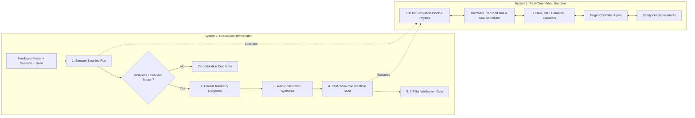
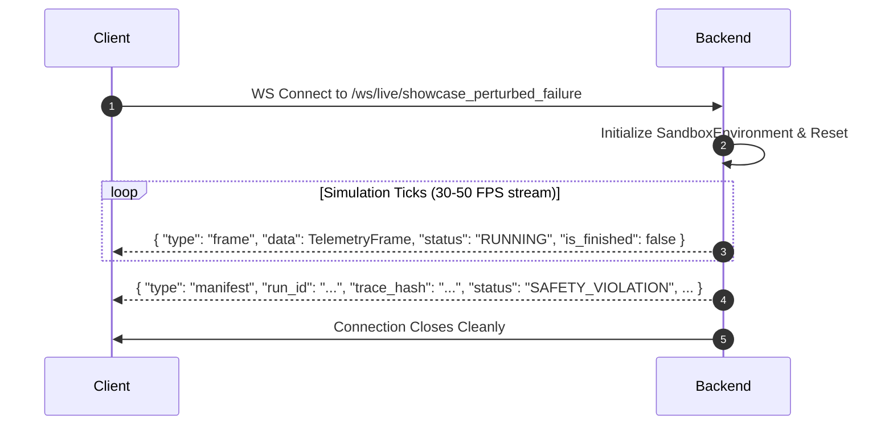

# TrueForge Agent Harness & Virtual Simulation Sandbox
## 🖥️ Frontend Engineering Specification & Integration Guide

**Document Version:** `1.0.0-final`  
**Backend API Version:** `v0.2.0`  
**Target Audience:** Frontend Engineers, UI/UX Developers, Visualizer Engineers  
**Backend Server Default Origin:** `http://localhost:8000` (FastAPI + WebSockets)

---

## 📑 Table of Contents
1. [System Architecture & Data Flow Mental Model](#1-system-architecture--data-flow-mental-model)
2. [Why 63k-Line JSON Exists vs WebSocket Streaming](#2-why-63k-line-json-exists-vs-websocket-streaming)
3. [Full TypeScript Type Definitions & Data Contracts](#3-full-typescript-type-definitions--data-contracts)
4. [Complete REST API Catalog](#4-complete-rest-api-catalog)
5. [WebSocket Real-Time Live Streaming Contract](#5-websocket-real-time-live-streaming-contract)
6. [2D Canvas Visualizer Coordinate System & Rendering Specs](#6-2d-canvas-visualizer-coordinate-system--rendering-specs)
7. [Client-Side Playback & Scrubber Engine Implementation](#7-client-side-playback--scrubber-engine-implementation)
8. [Causal DAG Graph Rendering Spec](#8-causal-dag-graph-rendering-spec)
9. [Code Patch Diff & Provenance Component](#9-code-patch-diff--provenance-component)
10. [3-Pillar Verification Matrix & Certification Badge](#10-3-pillar-verification-matrix--certification-badge)
11. [Deterministic Replay & Hash Auditing](#11-deterministic-replay--hash-auditing)
12. [Common Gotchas & Troubleshooting](#12-common-gotchas--troubleshooting)

---

## 1. System Architecture & Data Flow Mental Model

The platform consists of two cooperating engines:

1. **System 1 (Virtual Hardware Physics & Silicon Sandbox):**
   - Deterministic 100 Hz physics engine ($dt = 0.01\text{s}$), asynchronous hardware transport bus, multi-core SoC scheduler with thermal curves and deadline misses, LiDAR raycaster, IMU, cameras, and physical actuators.
2. **System 2 (Reliability Evaluation, Diagnostics & Auto-Patcher):**
   - Automated closed loop: Runs baseline simulation $\to$ captures invariant violations and granular event streams $\to$ builds an empirical causal Directed Acyclic Graph (DAG) $\to$ synthesizes code patch guards $\to$ re-runs verification on identical seed and hardware profile $\to$ evaluates 3-pillar safety matrix.



---

## 2. Why 63k-Line JSON Exists vs WebSocket Streaming

### ❓ The Question
> *"When calling `/api/scenarios/run` or `/api/harness/evaluate-full`, the backend returns a 63,000-line JSON payload in under 200ms. Is this precalculated or fake? How do we integrate this into a 60 FPS 2D visualizer?"*

### 💡 The Reality
1. **Simulation Execution Speed is Faster Than Real Time:**
   - The virtual sandbox runs math and kinematic physics in memory without heavy rendering locks. A 30-second episode with $3,000$ simulation steps ($dt = 0.01\text{s}$) executes in **~80–180ms of CPU wall time**.
2. **The JSON Contains the Complete Time-Series Trajectory:**
   - $3,000\text{ frames} \times \approx 20\text{ fields/frame}$ (kinematics, hardware CPU/temperature metrics, dynamic obstacles, actuator commands, queue depths, safety violations) $\approx 63,000\text{ lines of JSON}$.
3. **Two Frontend Integration Modes:**
   - **Mode A: Batch Ingestion & Client-Side Scrubbing (Default for Evaluation Workbench):**
     - You receive the complete `frames: TelemetryFrame[]` array up-front.
     - You store it in memory (`state.currentFrames = data.frames`).
     - A simple `setInterval` or `requestAnimationFrame` ticker advances `currentFrameIndex` at 50 Hz ($20\text{ms}$ per frame), drawing smoothly on canvas and giving the user instant scrubbing capabilities (pause, seek, step frame-by-frame, 0.5x/1x/2x/5x speed).
   - **Mode B: Live WebSocket Streaming (For Real-Time Monitoring):**
     - Connect to `ws://localhost:8000/ws/live/{scenario_id}`.
     - The server steps the environment in real time and streams individual `{ type: "frame", data: TelemetryFrame }` payloads every $10\text{ms}$ directly to your canvas.

---

## 3. Full TypeScript Type Definitions & Data Contracts

Copy-paste these exact types into your frontend codebase (e.g., `src/types/harness.ts`):

```typescript
// ==========================================
// 1. HARDWARE PRESETS
// ==========================================
export type EdgeBoardArchitecture = "ARM_CORTEX_A55" | "ARM_CORTEX_A78" | "ARM_CORTEX_A76" | "X86_64";

export interface HardwarePreset {
  id: string; // e.g. "RDK_X5", "JETSON_ORIN_NANO", "RASPBERRY_PI_5"
  name: string; // e.g. "D-Robotics RDK X5 (BPU 10 TOPS)"
  architecture: EdgeBoardArchitecture;
  cpu_cores: number;
  base_frequency_ghz: number;
  memory_bandwidth_gbps: number;
  npu_tops: number;
  thermal_throttle_temp_celsius: number;
  transport_latencies_ms: {
    camera: number;
    lidar: number;
    imu: number;
    can: number;
  };
  jitter_std_ms: {
    camera: number;
    lidar: number;
    imu: number;
    can: number;
  };
  description: string;
}

// ==========================================
// 2. SCENARIOS & WORLD ENTITIES
// ==========================================
export interface Vec2D {
  x: number;
  y: number;
}

export interface ObstacleSpec {
  id: string;
  type: "static" | "dynamic";
  x: number;
  y: number;
  heading: number; // radians
  width: number; // meters
  length: number; // meters
  target_speed?: number; // m/s (for dynamic obstacles)
  waypoints?: [number, number][]; // [[x1, y1], [x2, y2]]
}

export interface WorldSpec {
  width: number; // default 50.0m
  height: number; // default 50.0m
  goal: [number, number]; // [x, y]
  initial_state: {
    x: number;
    y: number;
    heading: number; // radians
    velocity: number; // m/s
  };
  obstacles: ObstacleSpec[];
}

export interface FaultDefinition {
  id: string; // e.g. "lidar_drop_01"
  type: "delay" | "drop" | "jitter" | "drift" | "stuck" | "scale" | "burst";
  target: string; // e.g. "sensor.lidar", "sensor.camera", "hardware.compute", "actuator.brake"
  start_time: number; // seconds
  duration: number; // seconds
  parameters: Record<string, any>;
}

export interface ScenarioDefinition {
  id: string;
  name: string;
  description: string;
  seed: number;
  max_sim_time: number; // seconds
  world: WorldSpec;
  fault_schedule: FaultDefinition[];
  safety_thresholds: {
    min_clearance: number; // meters (e.g. 0.8)
    speed_limit: number; // m/s (e.g. 6.5)
    max_observation_age_s: number; // seconds (e.g. 0.40)
  };
}

// ==========================================
// 3. TELEMETRY & FRAME TIME-SERIES
// ==========================================
export interface VehicleState {
  x: number;
  y: number;
  heading: number; // radians (0 = East (+X), PI/2 = North (+Y))
  velocity: number; // forward speed in m/s
  steer_angle: number; // radians
}

export interface ActuatorCommand {
  throttle: number; // 0.0 to 1.0
  steering: number; // -1.0 (left) to 1.0 (right)
  brake: number; // 0.0 to 1.0
  emergency_stop: boolean;
}

export interface HardwareMetrics {
  cpu_utilization: number; // 0.0 to 1.0 (percentage)
  temperature_celsius: number; // degrees Celsius
  is_throttled: boolean; // true if CPU throttled due to temp
  queue_depth: number; // pending compute queue count
  deadline_misses: number; // total deadline misses
}

export interface DynamicObstacleState {
  id: string;
  x: number;
  y: number;
  heading: number;
  velocity: number;
}

export interface SafetyViolation {
  rule_name: string; // "COLLISION", "UNSAFE_STOPPING_DISTANCE", "STALE_OBSERVATION", "SPEED_LIMIT"
  timestamp: number; // simulation seconds
  severity: "FATAL" | "CRITICAL" | "WARNING" | "INFO";
  description: string;
  details: Record<string, any>;
}

export interface TelemetryFrame {
  sim_time: number; // simulation timestamp in seconds (e.g. 4.1200)
  step: number; // tick index (0, 1, 2, ...)
  vehicle_state: VehicleState;
  actuator_command: ActuatorCommand;
  min_clearance: number; // distance to closest obstacle in meters
  active_faults: string[]; // IDs of currently active faults
  sensor_queue_depths: Record<string, number>; // e.g. {"sensor.camera": 1, "sensor.lidar": 0}
  hardware_metrics: HardwareMetrics;
  dynamic_obstacles: DynamicObstacleState[];
  new_violations: SafetyViolation[];
}

export interface RunManifest {
  run_id: string;
  seed: number;
  scenario_id: string;
  target_agent_version: string;
  fault_ids: string[];
  status: "COMPLETED" | "SAFETY_VIOLATION" | "TIMEOUT" | "ERROR";
  termination_reason: string;
  sim_duration_seconds: number;
  total_steps: number;
  violations_count: number;
  trace_hash: string; // SHA-256 bit-exact trace checksum
}

// ==========================================
// 4. LIVE EVENT STREAM
// ==========================================
export type HarnessEventType =
  | "SIMULATION_STARTED"
  | "SIMULATION_STEP"
  | "SIMULATION_TERMINATED"
  | "FAULT_INJECTED"
  | "FAULT_REVERTED"
  | "SENSOR_SAMPLED"
  | "PACKET_QUEUED"
  | "PACKET_DELIVERED"
  | "PACKET_DROPPED"
  | "TASK_SCHEDULED"
  | "TASK_COMPLETED"
  | "DEADLINE_MISSED"
  | "THERMAL_THROTTLED"
  | "COMMAND_ISSUED"
  | "CONTROLLER_EXCEPTION"
  | "CONTROLLER_CRASHED"
  | "INVARIANT_BREACHED"
  | "COLLISION_DETECTED"
  | "CLEARANCE_WARNING"
  | "DIAGNOSIS_COMPLETED"
  | "PATCH_GENERATED"
  | "VERIFICATION_PASSED"
  | "VERIFICATION_FAILED";

export type EventSeverity = "DEBUG" | "INFO" | "WARNING" | "ERROR" | "CRITICAL";

export interface HarnessEvent {
  evaluation_id: string;
  run_id: string;
  episode_id: string;
  event_id: string;
  sim_time: number;
  wall_time: number; // UNIX timestamp
  source: string; // e.g. "hardware.thermal", "transport.sensor.lidar", "safety.oracle"
  type: HarnessEventType;
  severity: EventSeverity;
  payload: Record<string, any>;
}

// ==========================================
// 5. CAUSAL DIAGNOSTICS & GRAPH
// ==========================================
export interface FailureTrigger {
  trigger_type:
    | "COLLISION"
    | "UNSAFE_STOPPING_DISTANCE"
    | "STALE_OBSERVATION_ACTION"
    | "SPEED_LIMIT_EXCEEDED"
    | "DEADLINE_CASCADING_FAILURE"
    | "CONTROLLER_CRASH"
    | "INSUFFICIENT_EVIDENCE";
  timestamp: number;
  entity_id: string;
  vehicle_speed: number;
  clearance: number;
  required_clearance: number;
  observation_age_s: number;
  details: Record<string, any>;
}

export interface CausalChainNode {
  node_id: string; // e.g. "node_01_fault"
  timestamp: number;
  category: "HARDWARE_FAULT" | "COMPUTE_BOTTLENECK" | "TRANSPORT_STALENESS" | "CONTROLLER_DECISION" | "SAFETY_BREACH";
  summary: string;
  metrics: Record<string, any>;
  evidence_event_ids: string[];
}

export interface CausalLink {
  source: string; // source node_id
  target: string; // target node_id
  relation: string; // e.g. "INDUCED_TRANSPORT_OR_PROCESSING_DELAY"
  confidence: number; // 0.0 to 1.0 (e.g. 0.95)
  evidence: Record<string, any>;
}

export interface TelemetryAnomaly {
  subsystem: string;
  anomaly_type: string;
  start_time: number;
  duration: number;
  severity_score: number; // 0.0 to 1.0
  description: string;
  evidence: Record<string, any>;
}

export interface CausalDiagnosticReport {
  report_id: string;
  run_id: string;
  evaluation_id: string;
  created_at: number;
  primary_root_cause: string;
  failure_trigger: FailureTrigger | null;
  causal_nodes: CausalChainNode[];
  causal_links: CausalLink[];
  anomalies_detected: TelemetryAnomaly[];
  contributing_fault_ids: string[];
  patch_recommendations: string[];
  markdown_summary: string;
}

// ==========================================
// 6. AUTO-PATCHER & PROVENANCE
// ==========================================
export type PatchStrategyType =
  | "DYNAMIC_STOPPING_BUFFER"
  | "STALE_SENSOR_FAIL_SAFE"
  | "SENSOR_FUSION_REDUNDANCY"
  | "HARDWARE_DELAY_COMPENSATION"
  | "COMBINED_FAILSAFE_HARDENING"
  | "RUNTIME_GUARD_WRAPPER"
  | "LLM_SYNTHESIZED";

export type PatchValidationStatus =
  | "PENDING"
  | "SYNTAX_VALID"
  | "INTERFACE_COMPLIANT"
  | "SYNTAX_ERROR"
  | "INTERFACE_VIOLATION"
  | "PATCH_NOT_APPLICABLE";

export interface PatchProvenance {
  source_controller_hash: string;
  diagnostic_report_id: string;
  evidence_event_ids: string[];
  strategy: PatchStrategyType;
  transformations_applied: string[];
  rationale: string;
}

export interface PatchResult {
  patch_id: string;
  report_id: string;
  strategies_applied: PatchStrategyType[];
  original_code: string;
  patched_code: string;
  unified_diff: string; // Standard unified diff text
  validation_status: PatchValidationStatus;
  validation_message: string;
  created_at: number;
  provenance: PatchProvenance | null;
  metadata: Record<string, any>;
}

// ==========================================
// 7. 3-PILLAR EVALUATION & RUN FINGERPRINT
// ==========================================
export type HarnessRunStatus =
  | "PENDING"
  | "RUNNING"
  | "COMPLETED"
  | "SAFETY_VIOLATION"
  | "CONTROLLER_CRASH"
  | "TIMEOUT"
  | "ERROR";

export type ControllerHealth = "HEALTHY" | "EXCEPTION_RAISED" | "TIMEOUT" | "INVALID_COMMAND";

export type VerificationVerdict =
  | "VERIFIED_SAFE"
  | "NOT_PROVEN_SAFE"
  | "SAFETY_VIOLATION"
  | "CONTROLLER_CRASHED"
  | "TASK_INCOMPLETE";

export interface RunConfigFingerprint {
  scenario_hash: string;
  hardware_preset_id: string;
  fault_schedule_hash: string;
  safety_policy_hash: string;
  controller_hash: string;
  seed: number;
  composite_hash: string;
}

export interface HarnessRun {
  run_id: string;
  evaluation_id: string;
  episode_id: string;
  status: HarnessRunStatus;
  controller_health: ControllerHealth;
  task_completed: boolean;
  distance_traveled_m: number;
  sim_duration_s: number;
  wall_duration_s: number;
  trace_hash: string;
  violations_count: number;
  violations: SafetyViolation[];
  metrics: {
    min_clearance: number;
    max_speed: number;
    avg_speed: number;
    violations_count: number;
  };
  events_count: number;
  fingerprint: RunConfigFingerprint | null;
  telemetry_frames?: TelemetryFrame[]; // Included if include_telemetry=True
}

export interface HarnessEvaluationResult {
  evaluation_id: string;
  verdict: VerificationVerdict;
  is_safe_under_test_conditions: boolean;
  safety_pillar_passed: boolean;
  behavior_pillar_passed: boolean;
  runtime_health_pillar_passed: boolean;
  baseline_passed: boolean;
  verification_passed: boolean;
  baseline_violations_count: number;
  verification_violations_count: number;
  min_clearance_baseline: number;
  min_clearance_verified: number;
  improvement_summary: string;
  audit_timestamp: number;
}

export interface HarnessEvaluation {
  evaluation_id: string;
  created_at: number;
  hardware_preset_id: string;
  scenario_id: string;
  seed: number;
  mode: "AUTONOMOUS_HARNESS" | "INTERACTIVE" | "BENCHMARK" | "REPLAY";
  baseline_run: HarnessRun | null;
  diagnosis: CausalDiagnosticReport | null;
  patch: PatchResult | null;
  verification_run: HarnessRun | null;
  final_result: HarnessEvaluationResult | null;
}
```

---

## 4. Complete REST API Catalog

All endpoints are hosted under `http://localhost:8000`.

### 4.1. Hardware Presets Endpoint
- **Method:** `GET`
- **URL:** `/api/harness/hardware-presets`
- **Description:** Returns the catalog of supported virtual edge boards. Use this to populate hardware profile selector dropdowns in the UI.
- **Response Format:**
```json
[
  {
    "id": "RDK_X5",
    "name": "D-Robotics RDK X5 (BPU 10 TOPS)",
    "architecture": "ARM_CORTEX_A55",
    "cpu_cores": 8,
    "base_frequency_ghz": 1.8,
    "memory_bandwidth_gbps": 34.1,
    "npu_tops": 10.0,
    "thermal_throttle_temp_celsius": 85.0,
    "transport_latencies_ms": { "camera": 35.0, "lidar": 18.0, "imu": 4.0, "can": 3.0 },
    "jitter_std_ms": { "camera": 6.0, "lidar": 3.0, "imu": 1.0, "can": 0.5 },
    "description": "High-performance edge robotics development kit."
  },
  {
    "id": "JETSON_ORIN_NANO",
    "name": "NVIDIA Jetson Orin Nano (40 TOPS)",
    "architecture": "ARM_CORTEX_A78",
    "cpu_cores": 6,
    "base_frequency_ghz": 1.5,
    "memory_bandwidth_gbps": 68.0,
    "npu_tops": 40.0,
    "thermal_throttle_temp_celsius": 90.0,
    "transport_latencies_ms": { "camera": 22.0, "lidar": 12.0, "imu": 2.5, "can": 2.0 },
    "jitter_std_ms": { "camera": 4.0, "lidar": 2.0, "imu": 0.8, "can": 0.4 },
    "description": "Embedded AI compute board with Ampere GPU."
  },
  {
    "id": "RASPBERRY_PI_5",
    "name": "Raspberry Pi 5 (Quad-Core A76)",
    "architecture": "ARM_CORTEX_A76",
    "cpu_cores": 4,
    "base_frequency_ghz": 2.4,
    "memory_bandwidth_gbps": 17.0,
    "npu_tops": 0.0,
    "thermal_throttle_temp_celsius": 80.0,
    "transport_latencies_ms": { "camera": 55.0, "lidar": 30.0, "imu": 8.0, "can": 5.0 },
    "jitter_std_ms": { "camera": 12.0, "lidar": 6.0, "imu": 2.0, "can": 1.0 },
    "description": "Cost-effective general compute SBC without hardware NPU."
  }
]
```

---

### 4.2. Scenarios Endpoint
- **Method:** `GET`
- **URL:** `/api/scenarios/`
- **Description:** Lists all registered scenario templates and world obstacle definitions.
- **Response Format:**
```json
[
  {
    "id": "showcase_perturbed_failure",
    "name": "Showcase Perturbed Failure & Recovery",
    "description": "Demonstration scenario with compound LiDAR latency, camera frame drops, and braking lag.",
    "seed": 1337,
    "max_sim_time": 15.0,
    "world": {
      "width": 50.0,
      "height": 50.0,
      "goal": [40.0, 25.0],
      "initial_state": { "x": 5.0, "y": 25.0, "heading": 0.0, "velocity": 0.0 },
      "obstacles": [
        { "id": "crossing_pedestrian", "type": "dynamic", "x": 22.0, "y": 25.0, "heading": 1.57, "width": 0.8, "length": 0.8, "target_speed": 1.2 }
      ]
    },
    "fault_schedule": [
      { "id": "camera_drop", "type": "drop", "target": "sensor.camera", "start_time": 2.0, "duration": 4.0, "parameters": { "drop_rate": 0.8 } }
    ],
    "safety_thresholds": { "min_clearance": 0.8, "speed_limit": 6.5, "max_observation_age_s": 0.40 }
  }
]
```

---

### 4.3. One-Click End-to-End Closed Loop Evaluation
- **Method:** `POST`
- **URL:** `/api/harness/evaluate-full`
- **Description:** Runs the entire System 2 lifecycle in a single call: Baseline Simulation $\to$ Causal Failure Analysis $\to$ Auto-Code Patcher $\to$ Verification Run $\to$ 3-Pillar Certification Matrix.
- **Request Body (`CreateEvaluationPayload`):**
```json
{
  "hardware_preset_id": "RDK_X5",
  "scenario_id": "showcase_perturbed_failure",
  "controller_code": null,
  "seed": 1337,
  "mode": "AUTONOMOUS_HARNESS"
}
```
- **Response:** Complete `HarnessEvaluation` JSON (includes `baseline_run`, `diagnosis`, `patch`, `verification_run`, and `final_result`).

---

### 4.4. Step-by-Step Interactive REST Pipeline
For step-by-step wizard UI or interactive human-in-the-loop review:

| Step | Method | URL | Payload Body | Returned Payload |
|---|---|---|---|---|
| **1. Create & Baseline** | `POST` | `/api/harness/evaluations` | `CreateEvaluationPayload` | `{ evaluation_id, baseline_run, ... }` |
| **2. Poll / Inspect** | `GET` | `/api/harness/evaluations/{evaluation_id}` | *None* | Full `HarnessEvaluation` state |
| **3. Diagnose** | `POST` | `/api/harness/evaluations/{evaluation_id}/diagnose` | *None* | `CausalDiagnosticReport` (DAG, anomalies, trigger) |
| **4. Generate Patch** | `POST` | `/api/harness/evaluations/{evaluation_id}/patch` | `PatchControllerPayload` | `PatchResult` (patched code, unified diff, provenance) |
| **5. Verify Patch** | `POST` | `/api/harness/evaluations/{evaluation_id}/verify` | `VerifyPatchPayload` | `{ verification_run, final_result }` |

---

### 4.5. Deterministic Replay Verification Endpoint
- **Method:** `POST`
- **URL:** `/api/scenarios/replay/{run_id}`
- **Description:** Replays a simulation episode under the exact same seed, verifies trace hash bit-exactness, and returns difference details if any non-determinism occurred.
- **Response Format:**
```json
{
  "replayed_manifest": { ... },
  "is_bit_exact_match": true,
  "original_trace_hash": "a4f891b2c3d4e5f6...",
  "replayed_trace_hash": "a4f891b2c3d4e5f6...",
  "difference_details": null,
  "frames": [ ... ]
}
```

---

## 5. WebSocket Real-Time Live Streaming Contract

- **WebSocket URL:** `ws://localhost:8000/ws/live/{scenario_id}`
- **Protocols:** Standard W3C WebSocket (`new WebSocket(...)`).
- **Connection Lifecycle:**



### Incoming Message Types on WebSocket:

#### 1. Frame Event (`type: "frame"`):
```json
{
  "type": "frame",
  "status": "RUNNING",
  "is_finished": false,
  "data": {
    "sim_time": 3.82,
    "step": 382,
    "vehicle_state": { "x": 18.45, "y": 25.0, "heading": 0.0, "velocity": 3.12, "steer_angle": 0.0 },
    "actuator_command": { "throttle": 0.5, "steering": 0.0, "brake": 0.0, "emergency_stop": false },
    "min_clearance": 0.75,
    "active_faults": ["camera_drop"],
    "sensor_queue_depths": { "sensor.camera": 3, "sensor.lidar": 0 },
    "hardware_metrics": { "cpu_utilization": 0.88, "temperature_celsius": 86.4, "is_throttled": true, "queue_depth": 4, "deadline_misses": 2 },
    "dynamic_obstacles": [{ "id": "crossing_pedestrian", "x": 19.2, "y": 25.0, "heading": 1.57, "velocity": 1.2 }],
    "new_violations": [
      { "rule_name": "UNSAFE_STOPPING_DISTANCE", "timestamp": 3.82, "severity": "CRITICAL", "description": "Clearance 0.75m < required 0.80m" }
    ]
  }
}
```

#### 2. Manifest Event (`type: "manifest"`):
```json
{
  "type": "manifest",
  "run_id": "run_98af21cb",
  "status": "SAFETY_VIOLATION",
  "termination_reason": "Fatal safety rule violation detected by Safety Oracle",
  "duration": 4.12,
  "steps": 412,
  "violations_count": 1,
  "trace_hash": "e3b0c44298fc1c149afbf4c8996fb92427ae41e4649b934ca495991b7852b855"
}
```

---

## 6. 2D Canvas Visualizer Coordinate System & Rendering Specs

### 6.1. Physics Coordinate System (World Coordinates)
- **Origin $(0,0)$:** Bottom-Left corner of the arena.
- **$+X$ Axis:** Points **East** (Right).
- **$+Y$ Axis:** Points **North** (Up).
- **Heading Angle $\theta$:** Radians, counter-clockwise from $+X$ (e.g. $0 = \text{East}$, $\pi/2 \approx 1.57 = \text{North}$, $\pi \approx 3.14 = \text{West}$, $-\pi/2 \approx -1.57 = \text{South}$).
- **Standard Arena Size:** `world.width = 50.0m`, `world.height = 50.0m`.

### 6.2. Canvas Transformation Equations
Since HTML5 `<canvas>` has $(0,0)$ at the **Top-Left** with $+Y$ pointing downward, convert all coordinates as follows:

```typescript
const scale = canvas.width / scenario.world.width; // pixels per meter (e.g., 800px / 50m = 16 px/m)

function worldToCanvas(worldX: number, worldY: number): { x: number; y: number } {
  return {
    x: worldX * scale,
    y: canvas.height - (worldY * scale) // Flip Y
  };
}
```

### 6.3. Layer-by-Layer Canvas Drawing Pipeline
Implement your render loop in the following order:

```typescript
function renderFrame(ctx: CanvasRenderingContext2D, frame: TelemetryFrame, scenario: ScenarioDefinition) {
  const w = ctx.canvas.width;
  const h = ctx.canvas.height;
  const scale = w / scenario.world.width;

  // 1. Clear Arena Background
  ctx.fillStyle = "#090d16"; // Dark slate
  ctx.fillRect(0, 0, w, h);

  // 2. Draw 5-meter Reference Grid
  ctx.strokeStyle = "#172033";
  ctx.lineWidth = 1;
  const gridPx = 5.0 * scale;
  for (let x = 0; x < w; x += gridPx) {
    ctx.beginPath(); ctx.moveTo(x, 0); ctx.lineTo(x, h); ctx.stroke();
  }
  for (let y = 0; y < h; y += gridPx) {
    ctx.beginPath(); ctx.moveTo(0, y); ctx.lineTo(w, y); ctx.stroke();
  }

  // 3. Draw Goal Point
  const goal = worldToCanvas(scenario.world.goal[0], scenario.world.goal[1]);
  ctx.fillStyle = "#fbbf24"; // Amber-400
  ctx.beginPath(); ctx.arc(goal.x, goal.y, 8, 0, 2 * Math.PI); ctx.fill();
  ctx.strokeStyle = "rgba(251, 191, 36, 0.3)";
  ctx.lineWidth = 4;
  ctx.beginPath(); ctx.arc(goal.x, goal.y, 14, 0, 2 * Math.PI); ctx.stroke();

  // 4. Draw Static Obstacles (AABB Boxes)
  scenario.world.obstacles.filter(o => o.type !== "dynamic").forEach(obs => {
    const pt = worldToCanvas(obs.x, obs.y);
    const ow = (obs.length || 1.5) * scale;
    const oh = (obs.width || 1.5) * scale;
    ctx.fillStyle = "#334155";
    ctx.fillRect(pt.x - ow / 2, pt.y - oh / 2, ow, oh);
    ctx.strokeStyle = "#475569";
    ctx.strokeRect(pt.x - ow / 2, pt.y - oh / 2, ow, oh);
  });

  // 5. Draw Dynamic Obstacles (Pedestrians/Vehicles)
  frame.dynamic_obstacles.forEach(dyn => {
    const pt = worldToCanvas(dyn.x, dyn.y);
    ctx.fillStyle = "#f43f5e"; // Rose-500
    ctx.beginPath(); ctx.arc(pt.x, pt.y, 7, 0, 2 * Math.PI); ctx.fill();
    ctx.strokeStyle = "#fda4af"; ctx.lineWidth = 2; ctx.stroke();

    // ID Tag
    ctx.fillStyle = "#cbd5e1";
    ctx.font = "10px monospace";
    ctx.fillText(dyn.id, pt.x - 15, pt.y - 12);
  });

  // 6. Draw Ego Vehicle (Rover) with Orientation
  const egoPt = worldToCanvas(frame.vehicle_state.x, frame.vehicle_state.y);
  const canvasHeading = -frame.vehicle_state.heading; // Inverted for canvas

  ctx.save();
  ctx.translate(egoPt.x, egoPt.y);
  ctx.rotate(canvasHeading);

  // Clearance Halo (Green if safe, Red if clearance breached)
  const isBreached = frame.min_clearance < 0.8;
  ctx.strokeStyle = isBreached ? "rgba(244, 63, 94, 0.6)" : "rgba(59, 130, 246, 0.25)";
  ctx.lineWidth = 2;
  ctx.beginPath();
  ctx.arc(0, 0, Math.max(frame.min_clearance, 0.8) * scale, 0, 2 * Math.PI);
  ctx.stroke();

  // Vehicle Body (1.4m length x 0.9m width)
  const vLength = 1.4 * scale;
  const vWidth = 0.9 * scale;
  ctx.fillStyle = isBreached ? "#e11d48" : "#4f46e5"; // Indigo / Crimson
  ctx.fillRect(-vLength / 2, -vWidth / 2, vLength, vWidth);
  ctx.strokeStyle = "#a5b4fc";
  ctx.lineWidth = 2;
  ctx.strokeRect(-vLength / 2, -vWidth / 2, vLength, vWidth);

  // Forward Nose Pointer
  ctx.strokeStyle = "#38bdf8"; // Sky-400
  ctx.lineWidth = 3;
  ctx.beginPath(); ctx.moveTo(0, 0); ctx.lineTo(vLength / 2 + 8, 0); ctx.stroke();

  ctx.restore();
}
```

---

## 7. Client-Side Playback & Scrubber Engine Implementation

Here is the complete, self-contained Playback Controller class for your visualizer component:

```typescript
export class SimulationPlaybackEngine {
  private frames: TelemetryFrame[] = [];
  private currentIndex: number = 0;
  private isPlaying: boolean = false;
  private playbackSpeed: number = 1.0;
  private timerId: number | null = null;
  private onFrameUpdate: (frame: TelemetryFrame, index: number, total: number) => void;

  constructor(onFrameUpdate: (frame: TelemetryFrame, index: number, total: number) => void) {
    this.onFrameUpdate = onFrameUpdate;
  }

  public loadFrames(frames: TelemetryFrame[]) {
    this.pause();
    this.frames = frames;
    this.currentIndex = 0;
    if (this.frames.length > 0) {
      this.onFrameUpdate(this.frames[0], 0, this.frames.length);
    }
  }

  public play() {
    if (this.frames.length === 0 || this.isPlaying) return;
    this.isPlaying = true;

    if (this.currentIndex >= this.frames.length - 1) {
      this.currentIndex = 0;
    }

    const intervalMs = Math.max(5, Math.floor(20 / this.playbackSpeed)); // 20ms = 50Hz base
    this.timerId = window.setInterval(() => {
      if (this.currentIndex >= this.frames.length - 1) {
        this.pause();
        return;
      }
      this.currentIndex += 1;
      this.onFrameUpdate(this.frames[this.currentIndex], this.currentIndex, this.frames.length);
    }, intervalMs);
  }

  public pause() {
    this.isPlaying = false;
    if (this.timerId !== null) {
      clearInterval(this.timerId);
      this.timerId = null;
    }
  }

  public seek(index: number) {
    this.pause();
    if (index >= 0 && index < this.frames.length) {
      this.currentIndex = index;
      this.onFrameUpdate(this.frames[this.currentIndex], this.currentIndex, this.frames.length);
    }
  }

  public stepForward() {
    this.seek(this.currentIndex + 1);
  }

  public stepBackward() {
    this.seek(this.currentIndex - 1);
  }

  public setSpeed(speedMultiplier: number) {
    this.playbackSpeed = speedMultiplier;
    if (this.isPlaying) {
      this.pause();
      this.play();
    }
  }
}
```

---

## 8. Causal DAG Graph Rendering Spec

When the user navigates to the **Diagnostics Tab**, render `CausalDiagnosticReport.causal_nodes` and `causal_links` using a graph library such as **React Flow**, **Cytoscape.js**, or **Mermaid.js**.

### Node Categories & Palette
| Category | Color Code | Icon | Description |
|---|---|---|---|
| `HARDWARE_FAULT` | `#f59e0b` (Amber) | ⚠️ | Perturbations injected into sensors, SoC, or buses |
| `COMPUTE_BOTTLENECK` | `#ef4444` (Red) | ⚡ | Thermal throttling, deadline misses, CPU load |
| `TRANSPORT_STALENESS` | `#8b5cf6` (Purple) | ⏱️ | Delayed observation delivery ($>200\text{ms}$) |
| `CONTROLLER_DECISION` | `#3b82f6` (Blue) | 🧠 | Control action taken on outdated/degraded state |
| `SAFETY_BREACH` | `#dc2626` (Crimson) | 💥 | Physical boundary or stopping distance violation |

### Link Attributes
- **Edge Label:** `relation` (e.g. `INDUCED_THERMAL_LOAD`, `TRANSPORT_OR_PROCESSING_DELAY`, `INSUFFICIENT_STOPPING_MARGIN`).
- **Confidence Badge:** `confidence` (e.g., `95% Confidence`).
- **Edge Tooltip:** Displays the `evidence` object (e.g., `{ observation_age_s: 0.41, clearance: 0.0 }`).

---

## 9. Code Patch Diff & Provenance Component

When rendering `HarnessEvaluation.patch`:

1. **Unified Diff Viewer:**
   - Use `@monaco-editor/react` or `react-diff-viewer-continued` with `patch.unified_diff` or `original_code` vs `patched_code`.
2. **Provenance Audit Card:**
   - Display `patch.provenance`:
     - **Source SHA-256:** `patch.provenance.source_controller_hash.substring(0, 16)}...`
     - **Diagnostic Ref:** `patch.provenance.diagnostic_report_id`
     - **Strategies Applied:** Badges for each strategy (e.g. `DYNAMIC_STOPPING_BUFFER`, `STALE_SENSOR_FAIL_SAFE`).
     - **Rationale:** `patch.provenance.rationale`.

---

## 10. 3-Pillar Verification Matrix & Certification Badge

When `HarnessEvaluation.final_result` is available, render the **3-Pillar Gate**:

```
+-----------------------------------------------------------------------------------+
|  🛡️ RELIABILITY VERIFICATION MATRIX                                               |
+-----------------------------------------------------------------------------------+
|  [ ✓ PASS ]  Pillar 1: Invariant Safety Oracle  (0 fatal violations, min 1.84m)   |
|  [ ✓ PASS ]  Pillar 2: Task & Behavior Progress (Distance traveled > 0.5m)        |
|  [ ✓ PASS ]  Pillar 3: Controller Runtime Health (Healthy, 0 unhandled crashes)   |
+-----------------------------------------------------------------------------------+
|  FINAL VERDICT: [ VERIFIED_SAFE ]  |  CERTIFICATE SHA: a918f029...                |
+-----------------------------------------------------------------------------------+
```

### Pillar Status Logic:
- **Pillar 1 (Safety):** `final_result.safety_pillar_passed === true`
- **Pillar 2 (Behavior):** `final_result.behavior_pillar_passed === true`
- **Pillar 3 (Runtime Health):** `final_result.runtime_health_pillar_passed === true`
- **Overall Verdict:** `final_result.verdict` (`VERIFIED_SAFE`, `SAFETY_VIOLATION`, `CONTROLLER_CRASHED`, `TASK_INCOMPLETE`).

---

## 11. Deterministic Replay & Hash Auditing

When the user clicks **"Verify Replay"** on any completed simulation run:
1. Call `POST /api/scenarios/replay/{run_id}`.
2. If `data.is_bit_exact_match === true`:
   - Display a verified shield badge: `✅ 100% Bit-Exact Determinism Match`.
   - Display `original_trace_hash` vs `replayed_trace_hash`.
3. If `false`:
   - Display alert banner with `data.difference_details`.

---

## 12. Common Gotchas & Troubleshooting

| Issue | Root Cause | Solution |
|---|---|---|
| **Canvas vehicle points the wrong direction** | Canvas $+Y$ goes downward; physics $+Y$ goes upward. | Negate the vehicle heading when calling `ctx.rotate(-frame.vehicle_state.heading)`. |
| **Scrubber animation lags on low-end machines** | Re-rendering heavy DOM metrics on every single frame. | Throttle DOM metrics updates to 10 Hz (every 5th frame) while keeping the `<canvas>` draw at 50 Hz. |
| **CORS errors when calling API** | Frontend running on port 3000/5173 while FastAPI runs on 8000. | The backend has `allow_origins=["*"]` configured. Ensure requests point to `http://localhost:8000`. |
| **WebSocket disconnects immediately** | Invalid or misspelled `scenario_id`. | Confirm the `scenario_id` exists in `/api/scenarios/` before initiating the WebSocket connection. |
| **JSON payload memory consumption** | Storing multiple 3000-frame runs simultaneously in Vue/React state. | Keep only the active baseline and verification runs in memory; garbage collect previous evaluations. |

---

*This specification represents the authoritative ground truth for all frontend visualizer, dashboard, and evaluation workbench implementations.*
