# Harness-Agent Frontend & Visualizer Integration Guide

## 1. Executive Summary: What You Are Building

As the frontend developer for **Harness-Agent**, you own the **Simulation Visualizer & Autonomous Agent Reliability Dashboard** (located in the `client/` directory). 

Your app interacts with a Python FastAPI backend (`backend/`) that runs a **Software-in-the-Loop Deterministic Hardware Simulation Testbed**. Your frontend acts as the control panel and visualizer for:
1. **Scenario & Hardware Selection**: Choosing simulation test environments and hardware preset constraints.
2. **2D Physical World Visualizer**: Rendering a 50m × 50m arena where an autonomous rover navigates toward a goal while dealing with obstacles and hardware faults.
3. **Timeline Scrubber & Replay Debugger**: Scrubbing through simulation frames (Play, Pause, 2x/5x speed) and verifying bit-exact determinism hashes.
4. **Hardware Telemetry HUD**: Monitoring CPU utilization, thermal throttling, temperature, packet queue depths, and safety violations in real-time.

---

## 2. Codebase Structure & File Mapping

```
client/
├── app/layout.tsx # Root layout and theme providers
├── app/page.tsx   # Main dashboard layout (Visualizer and Harness tabs)
├── components/    # Modular React components (Canvas, HUDs, Controls, HarnessView)
└── lib/           # API client, WebSocket stream client, and canvas renderer
```

### How `index.html` Connects to `app.js`:
- **Scenario Dropdown (`#scenario-select`)**: Populated via `GET /api/scenarios/`. When changed, updates scenario description and scheduled fault list (`#fault-list`).
- **Execution Button (`#btn-run`)**: Triggers `POST /api/scenarios/run` with selected scenario ID, RNG seed, and max time. Receives an array of telemetry frames and run manifest.
- **2D Canvas (`#sim-canvas`)**: A 600×600 HTML5 Canvas where `app.js` draws the 50m × 50m grid, goal point, static/dynamic obstacles, and the rover with a clearance halo and heading vector.
- **Timeline Scrubber (`#timeline-scrubber`)**: A range input that lets users scrub back and forth through execution frames.
- **Replay Button (`#btn-replay`)**: Calls `POST /api/scenarios/replay/{run_id}` to test bit-exact trace determinism.
- **Hardware Telemetry HUD**: Real-time stats updated every frame.

---

## 3. Visualizing the System Architecture & Data Flow

Below is a complete architectural diagram showcasing the frontend-backend closed loop, including how user actions trigger API requests and feed into the canvas rendering and playback loop.

```mermaid
graph TD
    %% Frontend Components
    subgraph Frontend ["Frontend Visualizer (HTML5, Tailwind, JS)"]
        UI[Dashboard / Controls]
        Canvas[2D Canvas Renderer]
        Loop[Playback Control Loop]
        HUD[Hardware Metrics HUD]
    end

    %% Backend Components
    subgraph Backend ["FastAPI Server (Python)"]
        Router[FastAPI Routing & WS Handler]
        Engine[Simulation Engine / Sandbox]
        Harness[Agent Reliability Harness]
    end

    %% Init & Configuration Flow
    UI -- "1. Get Preset Scenarios<br/>GET /api/scenarios" --> Router
    Router -- "2. Returns Scenarios List" --> UI

    %% Interactive Run Flow
    UI -- "3. Execute Episode<br/>POST /api/scenarios/run" --> Router
    Router -- "4. Triggers Sandbox Simulation" --> Engine
    Engine -- "5. Returns Completed Trace & Manifest" --> Router
    Router -- "6. Sends All Frames" --> UI

    %% Playback & Render Loop
    UI -- "7. Feed frames sequentially" --> Loop
    Loop -- "8. Scale coords & Draw" --> Canvas
    Loop -- "9. Update UI text/bars" --> HUD

    %% Replay Verification Flow
    UI -- "10. Check Determinism<br/>POST /api/scenarios/replay/{run_id}" --> Router
    Router -- "11. Replays Bit-Exact Episode" --> Engine
    Engine -- "12. Compares Trace Checksums" --> Router
    Router -- "13. Returns Determinism Status" --> UI

    %% WebSocket Stream option (Pattern B)
    UI -. "Alternate: Connect WS<br/>ws/live/{scenario_id}" .-> Router
    Router -. "Step simulation live" .-> Engine
    Engine -. "Stream frames (~30FPS)" .-> UI
    UI -. "Render directly to Canvas" .-> Canvas
```



---


# Harness-Agent Frontend Integration Guide

## 1. Overview & Backend Architecture

**Harness-Agent** is a software-in-the-loop deterministic hardware testbed, reliability engineering harness, and virtual hardware simulation sandbox. It enables autonomous edge/robotics agents to run against simulated hardware faults (e.g., thermal throttle, memory exhaustion, bit flips, power glitches, sensor noise), analyzes telemetry traces using causal diagnostics, automatically synthesizes hardened code patches via LLM/rule engines, and verifies patch safety bit-for-bit.

From a frontend developer's perspective, the backend provides:
- **REST APIs** for scenario management, simulation execution runs, telemetry querying, run replaying, hardware presets, and automated agent evaluation/patching loops.
- **WebSocket Streaming** for real-time visualization of agent movement, sensor telemetry, and fault injection events.
- **CORS Middleware** enabled globally (`allow_origins=["*"]`), permitting local development on Next.js/React frontends (`client/`).

---

## 2. API Endpoints Reference

Base URL: `http://localhost:8000` (or your deployment origin)

### System & Health
- **GET `/health`**
  - **Description**: Server liveness check.
  - **Auth**: None
  - **Response Example**: `{"status": "ok", "service": "harness-agent-sandbox"}`

---

### Scenarios (`/api/scenarios`)

#### 1. List Scenarios
- **HTTP Method**: `GET`
- **URL Path**: `/api/scenarios`
- **Auth**: None
- **Query Params**: None
- **Response**: `Array<ScenarioDefinition>`

#### 2. Get Scenario by ID
- **HTTP Method**: `GET`
- **URL Path**: `/api/scenarios/{scenario_id}`
- **Auth**: None
- **Response**: `ScenarioDefinition`
- **Error Responses**: `404 Not Found` if scenario ID does not exist.

#### 3. Execute Scenario Episode
- **HTTP Method**: `POST`
- **URL Path**: `/api/scenarios/run`
- **Auth**: None
- **Request Body**:
  ```json
  {
    "scenario_id": "showcase_perturbed_failure",
    "scenario_spec": null,


### Telemetry & Runs (`/api/runs`)

#### 1. Get Run Details
- **HTTP Method**: `GET`
- **URL Path**: `/api/runs/{run_id}`
- **Auth**: None
- **Response**: `RunDetailsResponse` (manifest, total_frames, frames).
- **Error Responses**: `404 Not Found`.

#### 2. Get Run Manifest Only
- **HTTP Method**: `GET`
- **URL Path**: `/api/runs/{run_id}/manifest`
- **Auth**: None
- **Response**: `RunManifest` object.

---

### Autonomous Agent Harness (`/api/harness`)

#### 1. Get Hardware Presets
- **HTTP Method**: `GET`
- **URL Path**: `/api/harness/hardware-presets`
- **Auth**: None
- **Response**: `Array<HardwarePreset>`

#### 2. Create & Run Baseline Evaluation
- **HTTP Method**: `POST`
- **URL Path**: `/api/harness/evaluations`
- **Auth**: None
- **Request Body**:
  ```json
  {
    "hardware_preset_id": "RDK_X5",
    "scenario_id": "showcase_perturbed_failure",
    "controller_code": null,
    "seed": 1337,
    "mode": "AUTONOMOUS_HARNESS"
  }
  ```
- **Response**: `HarnessEvaluation` object (including baseline run and telemetry).

#### 3. Get Evaluation Status & Results
- **HTTP Method**: `GET`
- **URL Path**: `/api/harness/evaluations/{evaluation_id}`
- **Auth**: None
- **Response**: `HarnessEvaluation` object.
- **Error Responses**: `404 Not Found`.

#### 4. Analyze Baseline Failure (Diagnostics)
- **HTTP Method**: `POST`
- **URL Path**: `/api/harness/evaluations/{evaluation_id}/diagnose`
- **Auth**: None
- **Response**: `CausalDiagnosticReport` object (causal graph, root causes, recommendations).
- **Error Responses**: `404 Not Found`.

#### 5. Generate Controller Patch
- **HTTP Method**: `POST`
- **URL Path**: `/api/harness/evaluations/{evaluation_id}/patch`
- **Auth**: None
- **Request Body**:
  ```json
  {
    "original_code": "def control_loop(obs): ...",
    "strategy": "thermal_throttling_guard"
  }
  ```
- **Response**: `PatchResult` object (patched code, diff, explanation).

#### 6. Verify Patched Controller
- **HTTP Method**: `POST`
- **URL Path**: `/api/harness/evaluations/{evaluation_id}/verify`
- **Auth**: None
- **Request Body**:
  ```json
  {
    "patched_code": "def control_loop(obs): ... # hardened"
  }
  ```
- **Response**: `VerificationResult` object (`verification_run`, `final_result`).

#### 7. Full End-to-End Closed Loop
- **HTTP Method**: `POST`
- **URL Path**: `/api/harness/evaluate-full`
- **Auth**: None
- **Request Body**: `CreateEvaluationPayload`
- **Response**: Complete `HarnessEvaluation` with baseline, diagnosis, patch, and verification proof.

---

### Real-Time WebSocket Streaming

- **WebSocket URL**: `ws://localhost:8000/ws/live/{scenario_id}`
- **Description**: Streams simulation frames and terminal manifest in real-time.
- **Incoming Message Format**:
  - Frame message: `{"type": "frame", "data": { ... TelemetryFrame ... }, "status": "RUNNING", "is_finished": false}`
  - Terminal message: `{"type": "manifest", "run_id": "...", "status": "COMPLETED", "violations_count": 0, "trace_hash": "..."}`
  - Error message: `{"type": "error", "message": "..."}`

---

    "seed": 1337,
    "max_sim_time": 60.0
  }
  ```
- **Response**: Object containing `manifest`, `total_frames`, and `frames`.
- **Error Responses**: `400 Bad Request` (missing params), `404 Not Found`.

#### 4. Replay Run & Check Determinism
- **HTTP Method**: `POST`
- **URL Path**: `/api/scenarios/replay/{run_id}`
- **Auth**: None
- **Response**: Object containing `replayed_manifest`, `is_bit_exact_match`, `original_trace_hash`, `replayed_trace_hash`, `difference_details`, and `frames`.
- **Error Responses**: `400 Bad Request` if run data unavailable or replay diverges.
