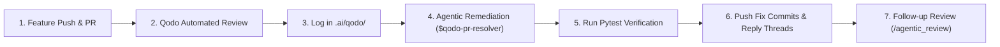

# Qodo AI Code Review Documentation & Reports (`docs/qodo/`)

Welcome to the **Qodo AI Review & Remediation Documentation** for the **Harness-Agent** project.

This directory houses all detailed code review findings, remediation tracking, decision rationales, and Qodo agentic integration guides across all pull requests.

---

## 🎯 Purpose & Quality Governance

In an Agent Harness Architecture, AI coding agents and human teammates collaborate at high velocity. **Qodo AI** acts as the independent Quality & Security Gatekeeper, ensuring that:
1. **Zero Bugs Slip Through:** Logic errors, edge cases, and numerical boundary conditions are surfaced before merging to `main`.
2. **Strict API Contracts & Documentation:** Non-trivial public methods, schemas, and endpoints maintain complete docstrings detailing parameters, return values, state mutations, and error modes.
3. **Traceability & Remediation Evidence:** Every review finding is logged, addressed with an agentic fix, verified with automated tests, and documented with explicit decision rationales.

## 📁 Pull Request Reviews & Resolutions Index

Every code review and resolution document is clearly prefixed and linked to its specific GitHub Pull Request:

| Pull Request | Scope | Findings Catalog | Remediation & Resolution | Status |
| :--- | :--- | :--- | :--- | :--- |
| [**PR #2 (Round 1)**](https://github.com/pranavsinghpatil/Harness-Agent/pull/2) | Virtual Hardware Simulation Sandbox | [`pr2_review_findings.md`](./pr2_review_findings.md) | [**`pr2_resolution.md`**](./pr2_resolution.md) | ✅ **100% Resolved & Verified** (26/26 Tests Passed) |
| [**PR #2 (Round 2)**](https://github.com/pranavsinghpatil/Harness-Agent/pull/2) | Sandbox Edge Cases & Governance | [`pr2_review_findings.md`](./pr2_review_findings.md) | [**`pr2_round2_resolution.md`**](./pr2_round2_resolution.md) | ✅ **100% Resolved & Verified** (28/28 Tests Passed) |
| [**PR #5**](https://github.com/pranavsinghpatil/Harness-Agent/pull/5) | Qodo Round 2 Remediation PR | [**`pr5_review_findings.md`**](./pr5_review_findings.md) | `pr5_resolution.md` | 🔍 **Review Documented (13 Findings)** |

---

## 📂 File Organization & Association Convention

```
docs/qodo/
├── README.md                 # Master index mapping each PR to its review and resolution docs
├── pr2_resolution.md         # PR #2: Round 1 resolution evidence (28 findings)
├── pr2_review_findings.md    # PR #2: Comprehensive catalog of findings
├── pr2_round2_resolution.md  # PR #2: Round 2 resolution evidence (20 findings)
├── pr5_review_findings.md    # PR #5: Catalog of 13 review findings
├── remediation_plan.md       # PR #2: Itemized engineering fix plan
└── skills_workflow_guide.md  # Qodo Agent Skills guide ($qodo-pr-resolver, /agentic_review)
```

---

## 📜 Permanent Rules & Protocols for Agents

The permanent operational rules, docstring standards (Rule 2945750), and pre-commit test gates are stored in:
👉 [`.ai/qodo.md`](file:///D:/GitRepo/harness/.ai/qodo.md)

---

## 🔄 The Qodo Review & Remediation Lifecycle



---

## 📌 Standard Operating Procedures

1. **Continuous Documentation:** Whenever Qodo reviews a PR or suggests improvements, parse and archive the findings in `.ai/qodo/`.
2. **No Silent Ignores:** Every finding must be either:
   - **Fixed:** Implemented with clear unit test coverage and docstring compliance.
   - **Deferred / Justified:** Documented in `remediation_plan.md` with a clear engineering rationale.
3. **Verification First:** Never push remediation commits without passing the full automated test suite: `pytest tests/ -v`.

The final backend freeze gate is recorded in
[`backend_freeze_contract.md`](./backend_freeze_contract.md).
