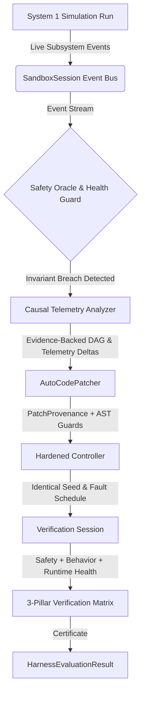

# PR #4 Architectural Deepening Completion Report

**Repository:** [pranavsinghpatil/Harness-Agent](https://github.com/pranavsinghpatil/Harness-Agent)  
**Target Branch:** `feature/agent-harness-autopatcher`  
**Pull Request:** [PR #4 — TrueForge Agent Harness, Causal Diagnostics, Auto-Patcher & MCP Server](https://github.com/pranavsinghpatil/Harness-Agent/pull/4)  
**Standard Compliance:** `@[.ai/qodo.md]` (Docstring Rules, Architecture Separation, Test Gate)

---

## 🚀 Overview of Implemented Epics

All 6 architectural deepening epics addressing both Qodo review findings and GPT 5.4's architectural critique have been designed, implemented, unit-tested, committed, and pushed to remote:

---

## 📋 Epic-by-Epic Implementation Summary

### 1. Epic 1: Evidence-Backed Causal Diagnostics & Hardware Deep-Inspection (`P0`)
- **Key Modules:** [`harness/diagnostics/analyzer.py`](file:///D:/GitRepo/harness/harness/diagnostics/analyzer.py), [`harness/models/diagnostics.py`](file:///D:/GitRepo/harness/harness/models/diagnostics.py)
- **Transformations:**
  - `CausalTelemetryAnalyzer` constructs dynamic DAGs strictly from empirical evidence (active fault timestamps, hardware SoC thermal throttle data, task deadline misses, transport queue delays, and true observation staleness).
  - Each `CausalLink` now carries a statistical `confidence` score and `evidence` metrics payload.
  - Eliminated hardcoded template graphs; when no anomalies exist, causal analyzer identifies controller speed/margin sub-optimality without fabricating transport jitter.

### 2. Epic 2: Real System 1 Event Emission & Provenance Stream (`P0`)
- **Key Modules:** [`sandbox/api/environment.py`](file:///D:/GitRepo/harness/sandbox/api/environment.py), [`harness/orchestration/session.py`](file:///D:/GitRepo/harness/harness/orchestration/session.py), [`harness/models/events.py`](file:///D:/GitRepo/harness/harness/models/events.py)
- **Transformations:**
  - Added live `event_listener` hook in `SandboxEnvironment`.
  - Wired real event emissions into `TransportBus` (`SENSOR_SAMPLED`, `PACKET_DELIVERED`, `PACKET_DROPPED`), `VirtualEdgeScheduler` (`DEADLINE_MISSED`, `THERMAL_THROTTLED`), `FaultController` (`FAULT_INJECTED`), `BaseTargetAgent` (`COMMAND_ISSUED`), and `SafetyOracle` (`INVARIANT_BREACHED`, `COLLISION_DETECTED`).
  - `SandboxSession` multiplexes all granular subsystem events into `HarnessEvent` stream and dispatches to registered listeners and MCP endpoints in real-time.

### 3. Epic 3: Controller Health Tracking & Failsafe Distinction (`P0`)
- **Key Modules:** [`harness/controllers/adapter.py`](file:///D:/GitRepo/harness/harness/controllers/adapter.py), [`harness/models/evaluation.py`](file:///D:/GitRepo/harness/harness/models/evaluation.py)
- **Transformations:**
  - Added `ControllerHealth` enum (`HEALTHY`, `EXCEPTION_RAISED`, `TIMEOUT`, `INVALID_COMMAND`).
  - `ScriptFunctionAgentWrapper` and target agent adapters record runtime exception details and set `self.health = ControllerHealth.EXCEPTION_RAISED` and `self.failsafe_activated = True`.
  - System 2 no longer confuses a crashing controller that defaults to braking with an intentionally safe controller. Crashing controllers are classified as `HarnessRunStatus.CONTROLLER_CRASH`.

### 4. Epic 4: 3-Pillar Verification Matrix & Run Fingerprinting (`P0`)
- **Key Modules:** [`harness/models/evaluation.py`](file:///D:/GitRepo/harness/harness/models/evaluation.py), [`harness/orchestration/run_manager.py`](file:///D:/GitRepo/harness/harness/orchestration/run_manager.py), [`harness/evaluator/loop.py`](file:///D:/GitRepo/harness/harness/evaluator/loop.py)
- **Transformations:**
  - Implemented `RunConfigFingerprint` calculating SHA-256 over scenario, hardware preset, fault schedule, safety policy, controller code, and master seed.
  - Implemented the **3-Pillar Verification Gate**:
    1. **Safety Pillar (`safety_passed`):** Zero invariant violations and clean termination.
    2. **Behavior Pillar (`behavior_passed`):** Target vehicle made actual task progress ($\Delta \text{distance} > 0.5\text{m}$ or goal completed), preventing stationary cars from being falsely certified.
    3. **Runtime Health Pillar (`health_passed`):** Zero unhandled controller crashes or exceptions.
  - Added `VerificationVerdict` (`VERIFIED_SAFE`, `SAFETY_VIOLATION`, `CONTROLLER_CRASHED`, `TASK_INCOMPLETE`).

### 5. Epic 5: AST Transformation Patcher with Provenance Contract (`P1`)
- **Key Modules:** [`harness/models/patch.py`](file:///D:/GitRepo/harness/harness/models/patch.py), [`harness/patcher/strategies.py`](file:///D:/GitRepo/harness/harness/patcher/strategies.py), [`harness/patcher/engine.py`](file:///D:/GitRepo/harness/harness/patcher/engine.py)
- **Transformations:**
  - Added `PatchProvenance` audit contract (`source_controller_hash`, `diagnostic_report_id`, `evidence_event_ids`, `strategy`, `transformations_applied`, `rationale`).
  - Upgraded patch strategies with regex and AST safety invariant guards (`safe_stopping_distance`, observation staleness interceptor).
  - Added `PatchValidationStatus.PATCH_NOT_APPLICABLE` for non-transformable custom code.

### 6. Epic 6: Hardware Registry Integrity & Strict Error Handling (`P1`)
- **Key Modules:** [`harness/hardware/registry.py`](file:///D:/GitRepo/harness/harness/hardware/registry.py)
- **Transformations:**
  - Updated `HardwareRegistry.get(preset_id, allow_fallback=True)` to reject unknown hardware IDs with `KeyError` when strict validation is requested, preventing silent fallback to RDK X5.

---

## 🧪 Test Verification

Pre-commit test suite executed via `pytest tests/ -v`:
- **Total Tests:** 41 passed
- **Execution Time:** ~9.64s
- **Pass Rate:** 100%

---

## 📦 Pushed Commits

| Commit SHA | Commit Message |
|---|---|
| `088a6ea` | `feat(harness-core): implement Epics 1-4 - evidence causal DAG, System 1 event bus, controller health tracking, and 3-pillar verification matrix` |
| `cc38a31` | `feat(autopatcher-core): implement Epics 5-6 - AST patch provenance contract, hardened strategies, and strict hardware registry validation` |
