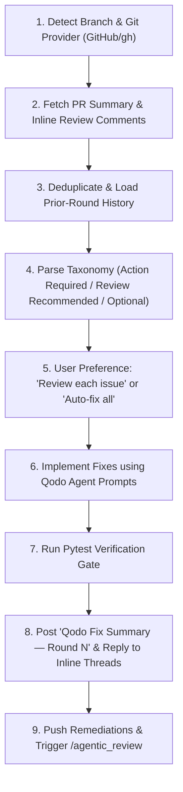

# Qodo Agent Skills Workflow Guide

This guide details how our team integrates **Qodo Agent Skills** (`qodo-pr-resolver` and `/agentic_review`) with AI coding agents to automate code review resolution, thread replies, oscillation prevention, and verification.

---

## 🛠️ Setup & Installation

To install the Qodo Agent Skills in your local workspace:

```bash
npx skills add qodo-ai/qodo-skills/skills
```

The skills are installed into `.agents/skills/`:
- `.agents/skills/qodo-get-rules/` — Semantic rule fetching for coding tasks
- `.agents/skills/qodo-pr-resolver/` — Automated PR review resolver and inline thread reply engine

---

## 🚀 The `qodo-pr-resolver` Protocol & Execution Flow



---

## 📋 Step-by-Step Lifecycle Guide

### Step 1: Ingestion & Deduplication
- Reads PR-level summary comments and inline comments from `qodo-merge[bot]` or `qodo-code-review`.
- Preserves exact verbatim titles and inline comment IDs for thread replies.
- Categorizes findings under Qodo's own severity buckets: **Action required**, **Review recommended**, **Optional**.

### Step 2: Oscillation Guard
- Tracks previously applied fixes across review rounds to prevent flip-flopping.
- Tags issues as **🔁 Repeat** or **⚠️ Contradiction** if a suggested change reverses a prior deliberate decision.

### Step 3: Direct Agent Prompt Execution
- Executes the exact `Agent Prompt` provided by Qodo for each finding without reinterpreting or guessing.
- Applies changes and stages them for commit.

### Step 4: Verification & Automated Tests
- Runs `pytest tests/ -v` to ensure zero regressions before posting summary or pushing.

### Step 5: Post Summary & Reply to Threads
- Posts top-level PR comment formatted as:
  ```markdown
  ## Qodo Fix Summary — Round 1
  ...
  _Generated by Qodo PR Resolver skill_
  ```
- Replies to each inline comment thread resolving the issue.

### Step 6: Push & Follow-Up Review
- Pushes commits to `git push origin <branch>`.
- Triggers follow-up review by posting `/agentic_review` on the pull request.

